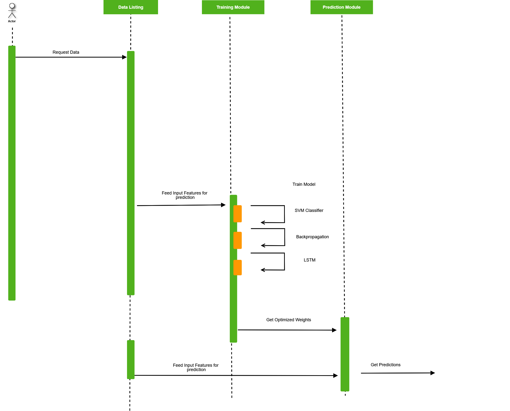

Stock Market Price Prediction (Python 3, Keras, Scikit Learn)
*  Developed an ML model to predict a change in stock price using LSTM, 
    back propagation and SVM algorithms by compiling data from yahoo 
    finance (January 2010 to December 2016)
*   Calculated metrics to aid the prediction: Index Momentum, Stock Price Volatility, 
     Sector Momentum and Stock Momentum
*    Achieved an accuracy of 62% for Backpropagation and SVM and an 
     accuracy of 73% for LSTM, 
*   Achieved T-test value of +-1.701, precision of 79% and a Standard Deviation
    of 1.36 which is acceptable for stock market datasets because of high volatility 
     in market trends.
